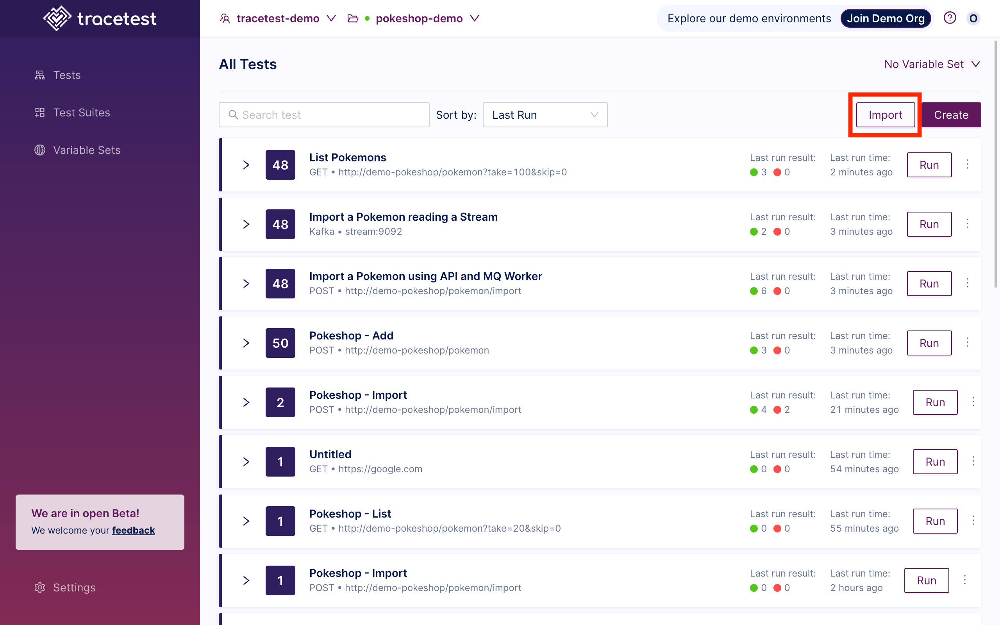
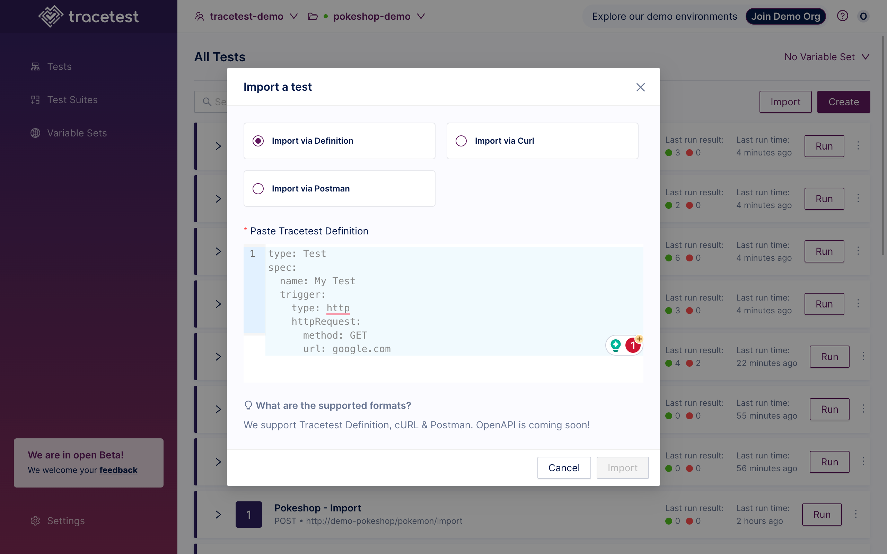
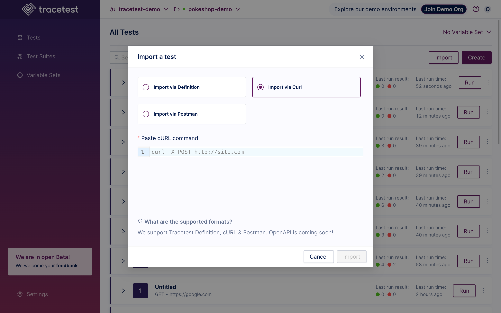
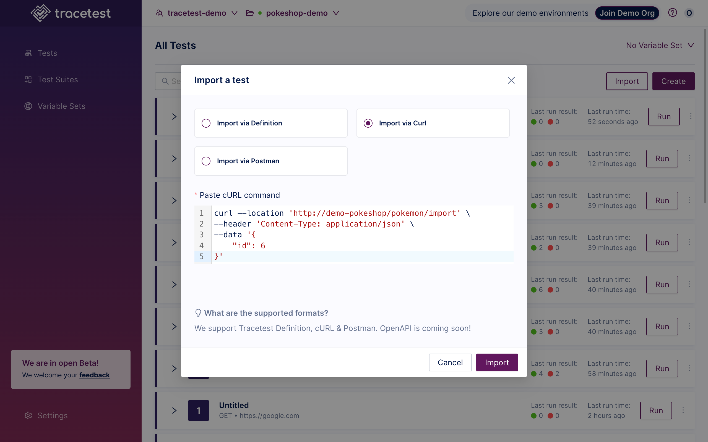
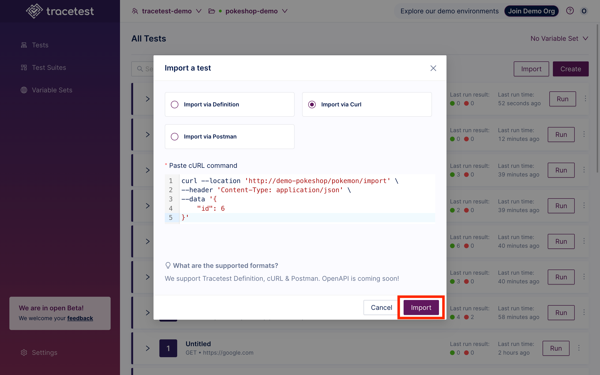
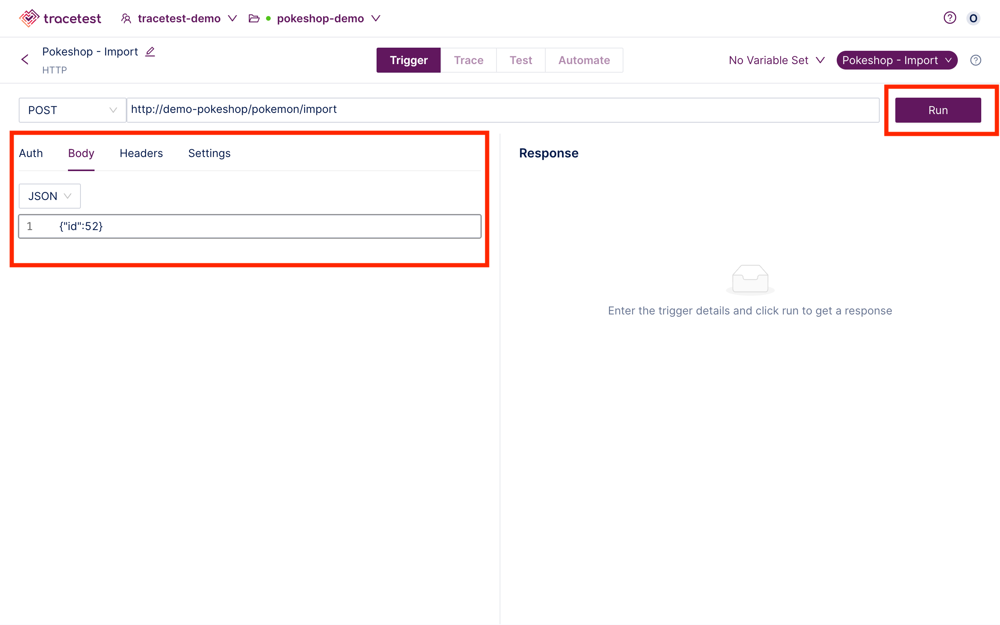
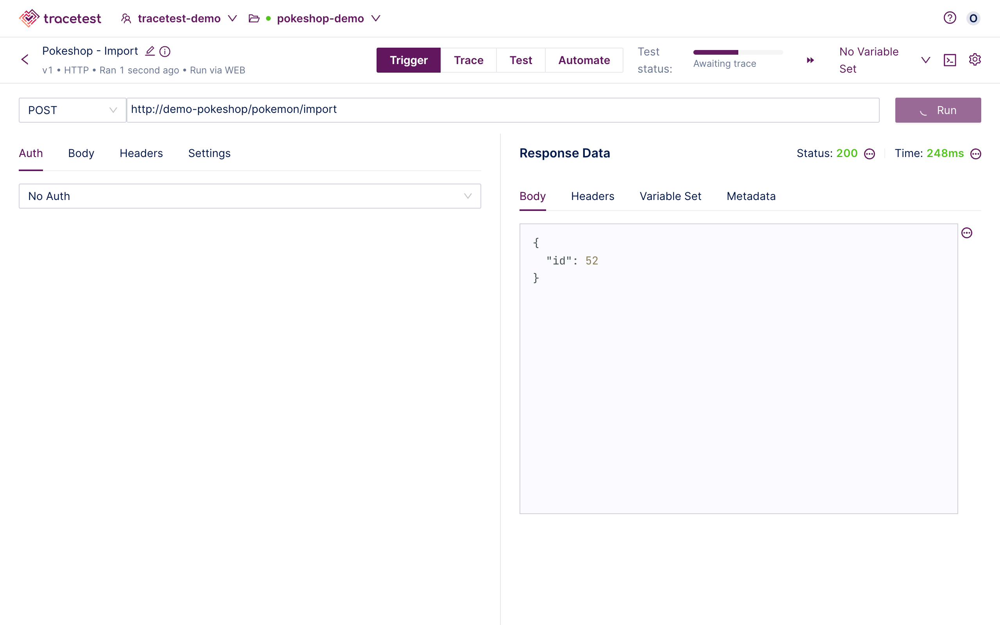
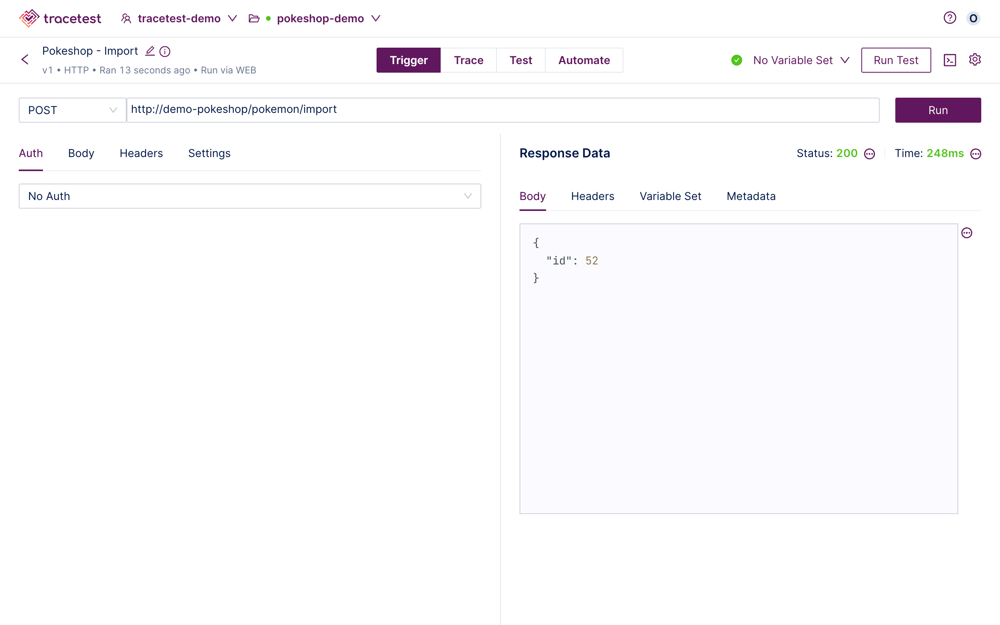

👉 **Join our [shared Pokeshop API Demo environment](https://app.tracetest.io/organizations/ttorg_2179a9cd8ba8dfa5/invites/invite_760904a64b4b9dc9/accept) and try importing a Test yourself!**


Click the **Import** button:



The "Import a Test" dialog appears:



The option to choose the import method is presented:

- Definition - Use a Tracetest Definition file as a starting point.
- Postman - Define your HTTP request via a Postman collection.
- CURL Command - Define your HTTP test via a cURL command.

Choose **CURL** to display the import options:



Input a valid **CURL Command**:



**Curl Command** used for this example:

```bash
curl --location 'http://demo-pokeshop/pokemon/import' \
--header 'Content-Type: application/json' \
--data '{
    "id": 6
}'
```

Click **Import**:



From the Create Test Page add any additional information and click **Run**:



The test will start:



When the test is finished, you will get the following results:



Please visit the [Test Results](/web-ui/test-results) document for an explanation of viewing the results of a test.

👉 **Join our [shared Pokeshop API Demo environment](https://app.tracetest.io/organizations/ttorg_2179a9cd8ba8dfa5/invites/invite_760904a64b4b9dc9/accept) and try importing a Test yourself!**