From the **All Tests** screen, you can access all your existing tests, create new tests and see the results of any test that has been run.  

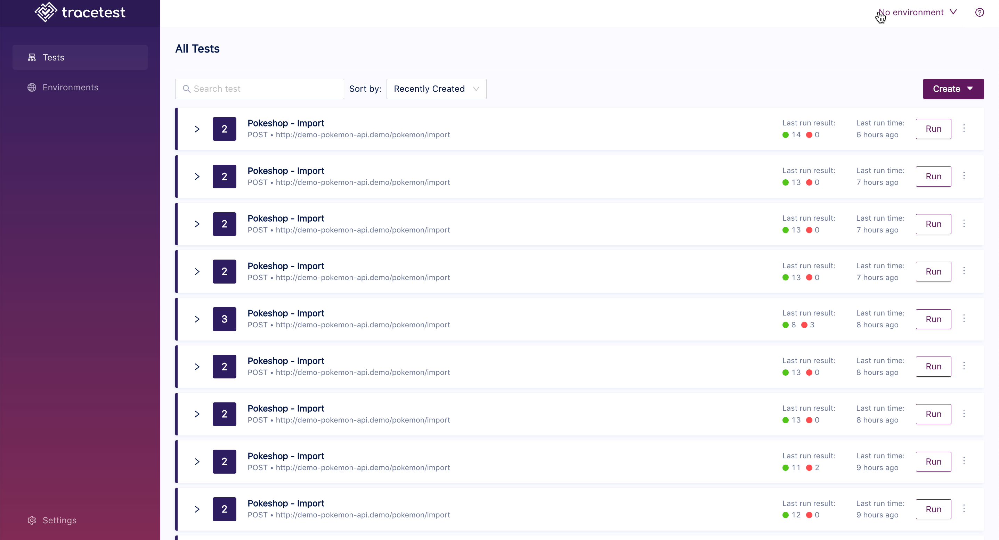

CLick on the settings icon to the right of each test. You can delete the test from here:

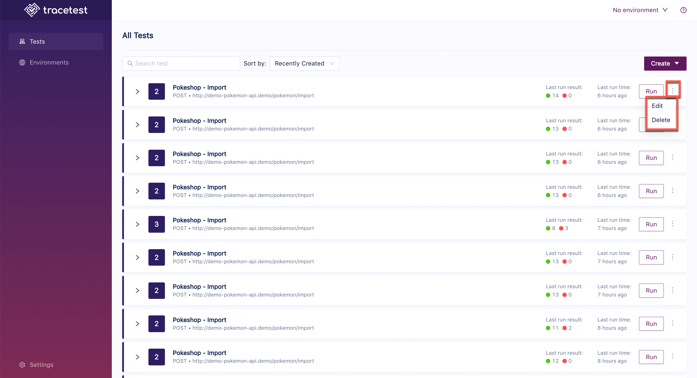

Click on the arrow next to the test name and the list of test runs will appear:

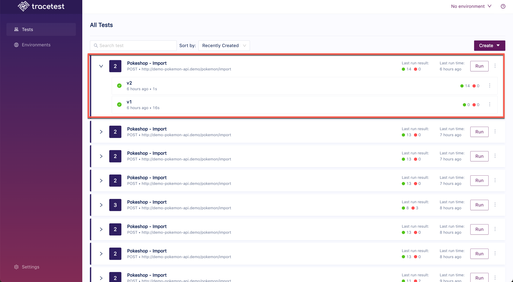

Click on a test run and the Trigger Details screen will open. From here, you can change and save the details of the test. On the top right, there is a button to run the test and a settings icon with the following options:

- JUnit Results - The test results in JUnit format.
- Test Definition - The test defintion YAML file.
- Edit - Edit the test.
- Delete - Delete the test.

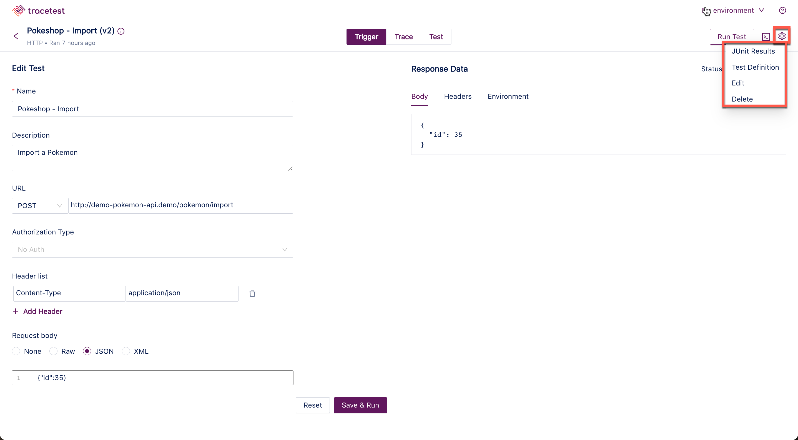

Click on the **Trace** tab to open the Trace Details screen:

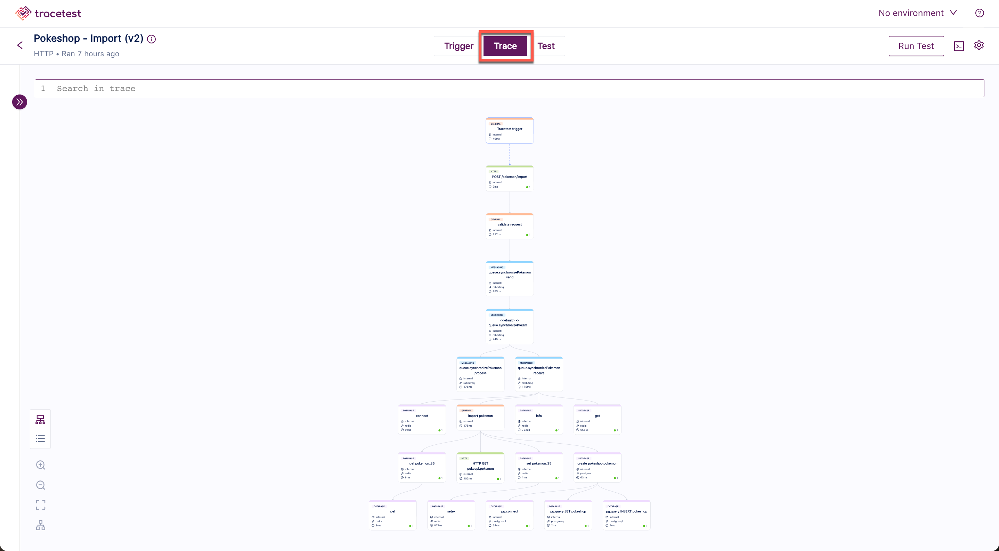

 Use the icons at the bottom left to manipulate the test image. The options are:

- Graph View
- Timeline View
- Zoom In
- Zoom Out
- Fit View
- Mini Map

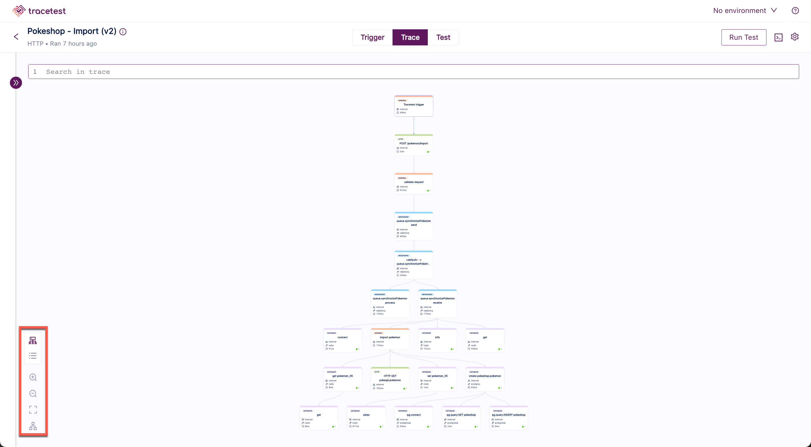

The following shows the test in the **Timeline View**:

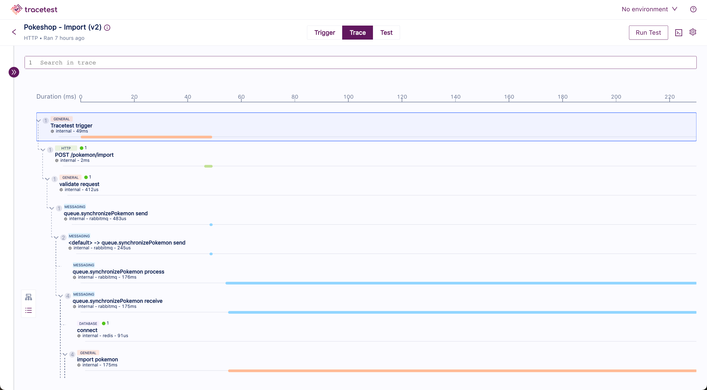

Click on the **Test** tab to see the details of Test Specs and Assertions for the test:

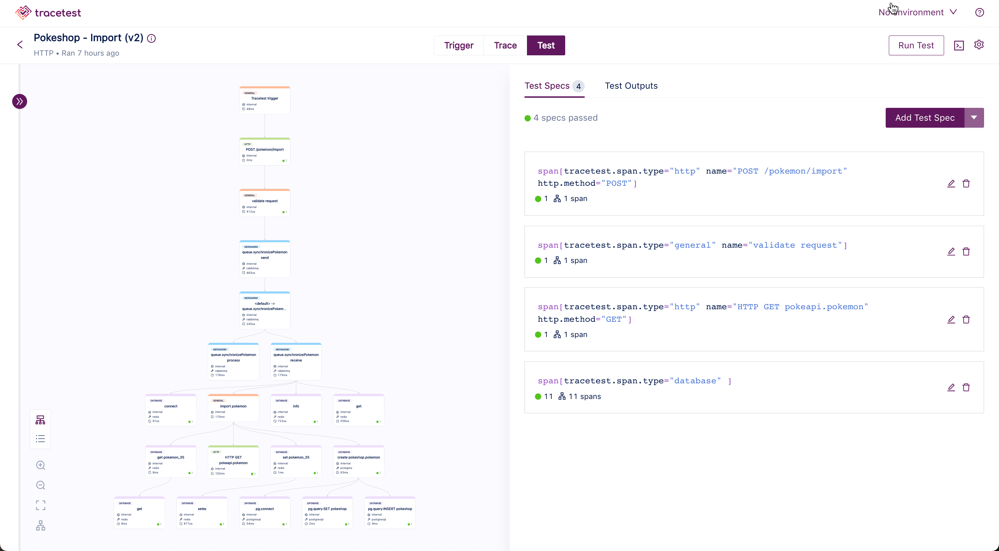

<!-- The test results include:

- A diagram of the trace steps that can be viewed in diagram or timeline form by toggling the icons at the top left of the image below. This panel also contains a **search** field which can be useful when working with large diagrams and timelines.
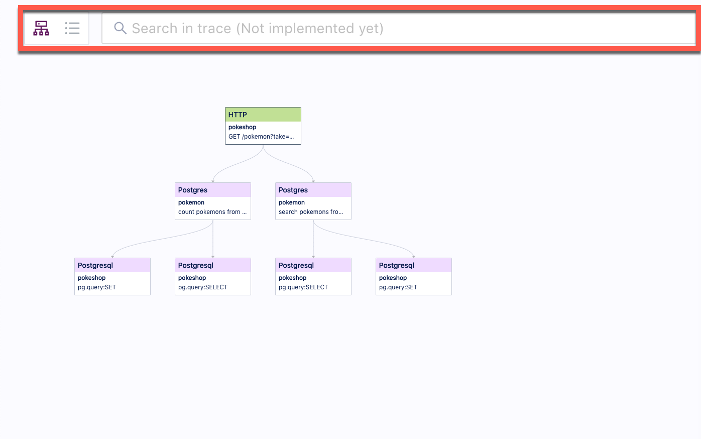
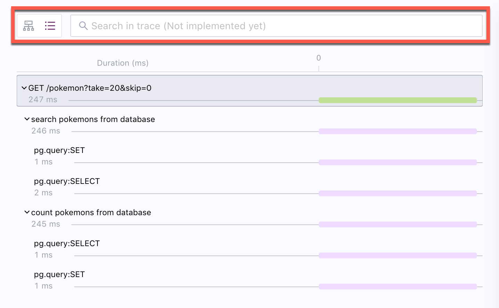

- The span details of the trace:
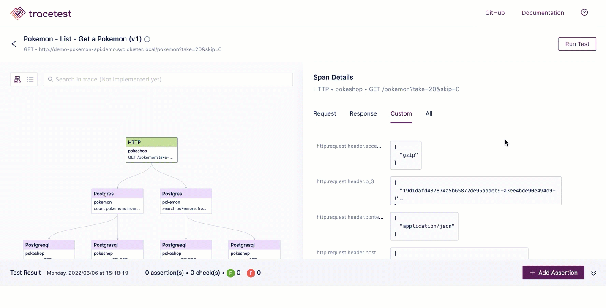 -->
