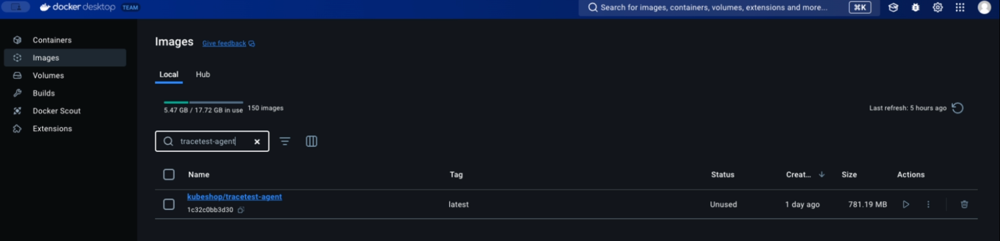
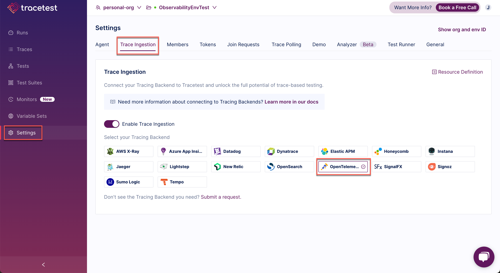
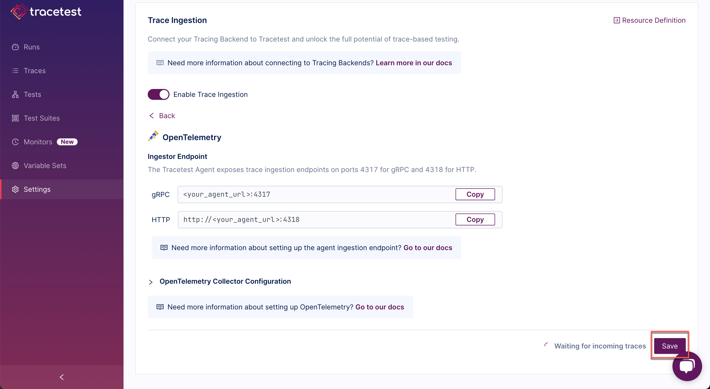
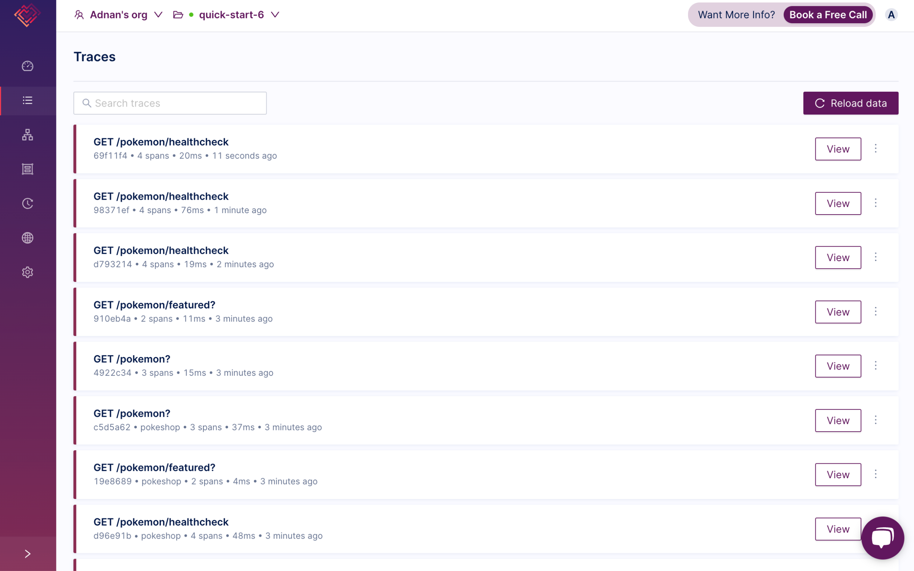
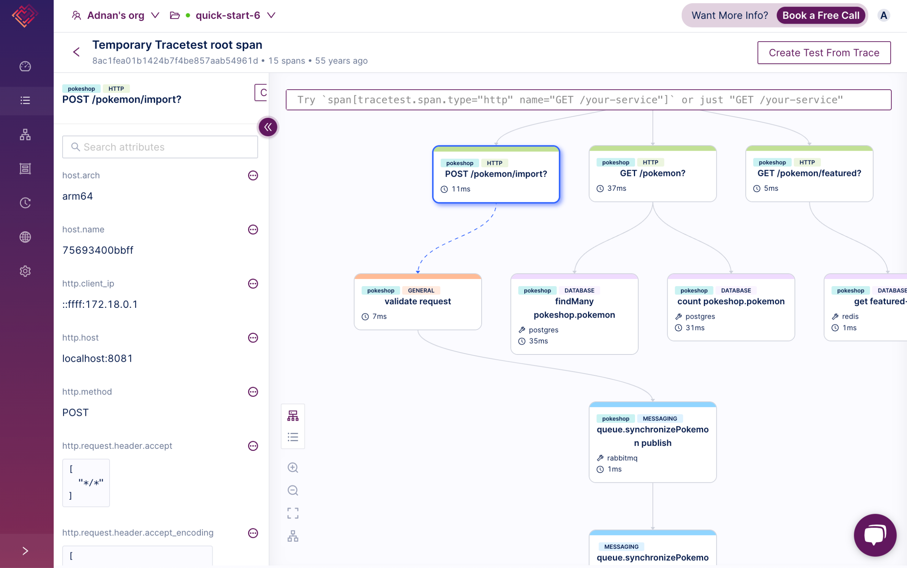

# Trace Mode

Trace Mode enables you to verify trace ingestion is configured correctly, and is also as a starting point to create trace-based tests.

You can use it to:
- View traces coming in to your Tracetest account.
- Create tests from certain trace spans. Tracetest figures out how to help you trigger tests based on span attributes and metadata.
- Create tests from trace IDs.

:::note
Traces will be deleted after 4 days.
:::

The steps to use Tracetest Trace Mode are:

**1.** Pull the latest version of the Pokeshop repo master branch [here](https://github.com/kubeshop/pokeshop). 

**2.** Make sure Docker is running.

**3.** In the Docker Desktop, search for and make sure to delete any previous agent image.

**4.** Create the .env file in the pokeshop root folder from the template and add
`POKESHOP_DEMO_URL=http://localhost:8081
TRACETEST_AGENT_API_KEY=<your-agent-api-key>
TRACETEST_ENVIRONMENT_ID=<your-environment-id>
TRACETEST_TRACE_MODE=true`.

The agent API key and Environment ID can be found [here](https://app.tracetest.io/retrieve-token).

**5.** From the `pokeshop` root folder run `docker compose -f docker-compose.yml -f docker-compose.e2e.yml up -d`.

**6.** From the Tracetest app, in **Settings**, go to the **Trace Ingestion** configuration tab and select **Open Telemetry**.

You will see the **Open Telemetry** details and click **Save**:

**7.** Open your environment dashboard and look at the Traces' landing page.

**8.** Play around with the Pokeshop UI at http://localhost:8081. You'll see traces appearing in the landing page.

