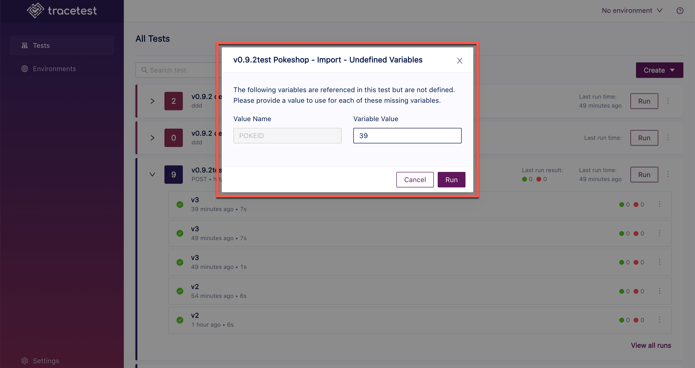
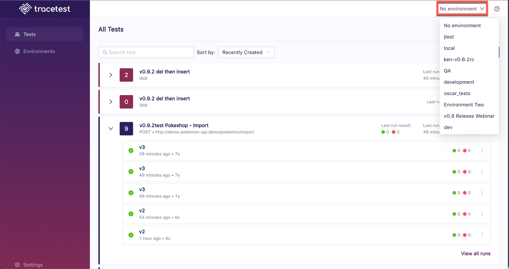

When a user runs a Test or a Test Suite, any variables that will be needed but are not defined will be prompted for:

Undefined variables are dependent on the environment selected and whether or not the variable is defined in the current environment. Select the environment to run the Test or Test Suite in from the dropdown list at the top right of the page:

:::tip
[Check out use-cases for using undefined variables here.](/concepts/ad-hoc-testing)
:::
