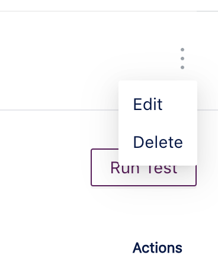
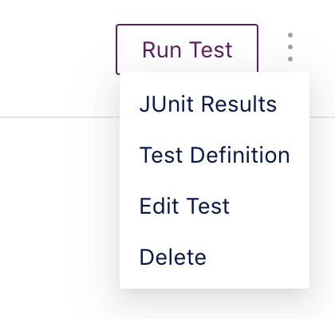
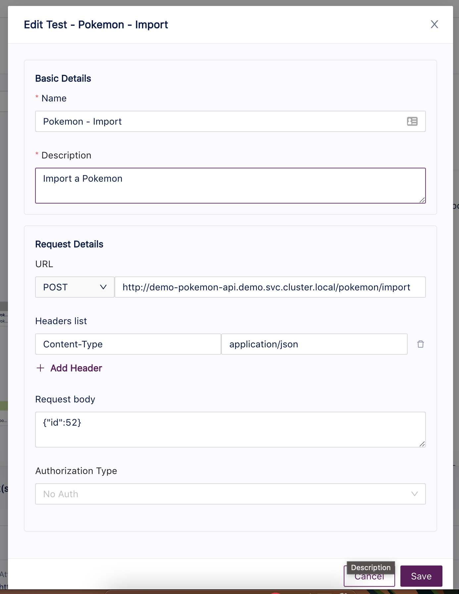
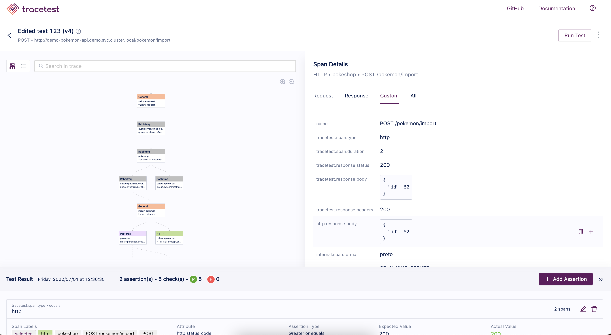

# Edit a Test

Tracetest enables you to update the test details anytime you need to. In case you have to update any of the details regarding the triggering method or the basic details such as **name** and/or **description**.

This process is really simple and can be achieved from three different places within the app. It can be done from:
1. The home page.
2. The test details page.
3. The Result/Trace page.

In any of these pages you'll find a menu dropdown that indicates there are more actions that can be executed for the viewing element.

## The Edit Form

The edit form is composed by the basic details and the request details sections.

The basic details section includes the information regarding the test metadata like **name, description, test suite (future)**.
While the request details is a changing section depending on what triggering method was used to create it in the first place. For example, if the test was created using the RPC triggering method instead of HTTP the request details will show different inputs like **method, message and metadata**.

After updating the different information displayed in the form you can simply click **Save**.

Every time the test is updated a new run will be executed with the latest information and the version of the test will increase by one.
In the end you'll be redirected to the run/trace page where you can validate if any of the previous assertions is breaking, the trace changed or anything like that.

