# Pokeshop - Import Pokemon Endpoint

This endpoint showcases a more complex scenario involving an async process. Usually, when working with microservices, there are use cases where some of the processing needs to happen asynchronously, for example, when triggering a user notification, generating reports, or processing a payment order. With this endpoint, we provide an example of how users can implement trace-based testing for such scenarios.

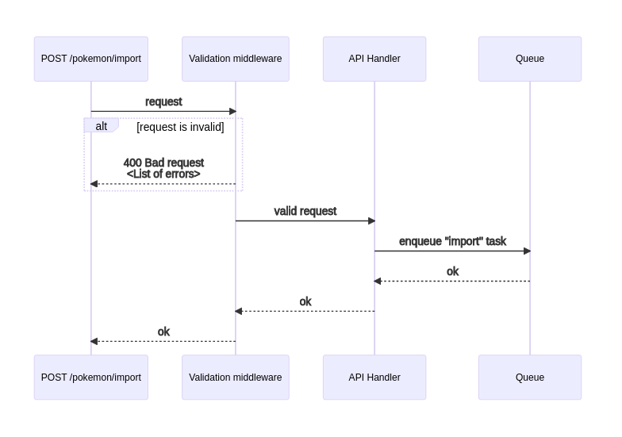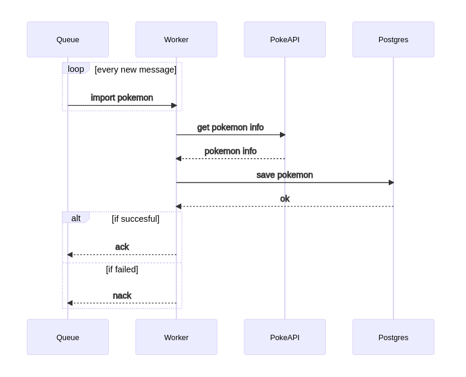

## **Endpoint Specification**

Route: `/pokemon/import`

Method: `POST`

Request Body:

```java

{

"id":  1

}

```

Response:

```java

{

"id":  1000,

"name":  "meowth",

"type":  "normal",

"imageUrl":  "https://assets.pokemon.com/assets/cms2/img/pokedex/full/052.png",

"isFeatured":  true

}

```

## **Trace**

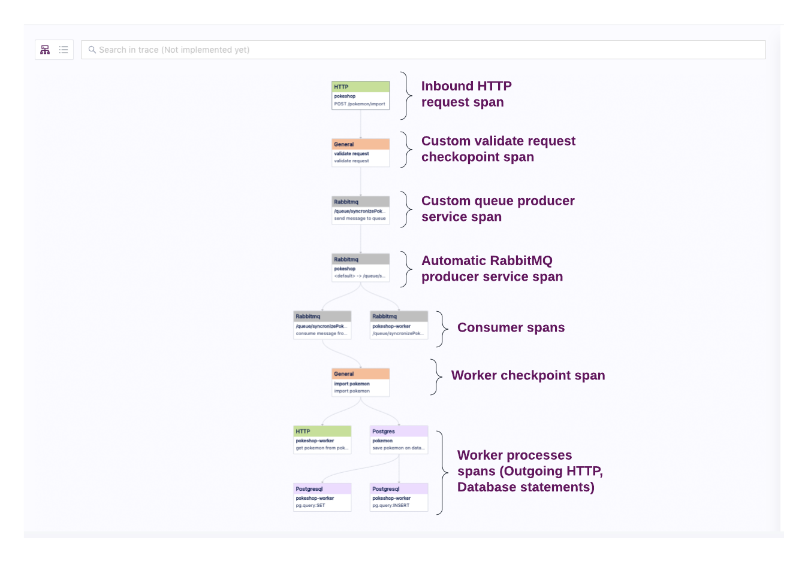

## **Assertions**

Here are some key points that are relevant to this query.

**Validate the Message Is Sent to the Queue**

To validate what’s being sent from the API to the worker, we can click the custom queue producer span and validate the `messaging.payload` attribute exists under the custom tab. To add an assertion targeting this attribute, we can select the **add assertion** icon that shows up while hovering over it.

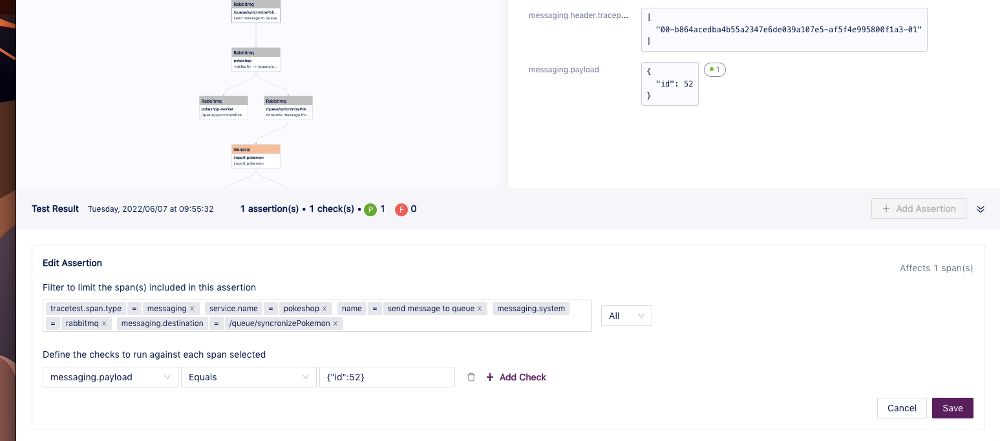

After that, we can tweak the assertion to match the expected value from the attribute.

Clicking **add** should show the newly created assertion.

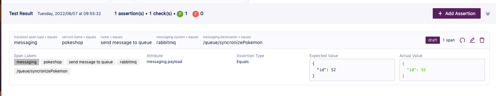

**Validate the Message Is Processed by the Worker**

The next thing would be to add an assertion related to the worker receiving the message and starting to process the job.

We can achieve this by validating that the custom checkpoint for the worker exists. In this case, we can click the `import pokemon` general span, then click on the **add assertion** button.

After this is done, we can proceed to add checks for the `service.name` and `process.command` attributes that should match the specific worker metadata.

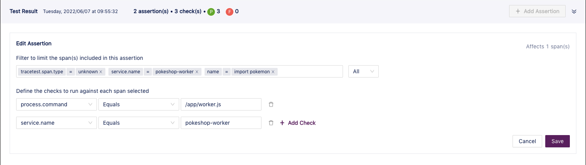

Clicking **save** should display the newly created assertion

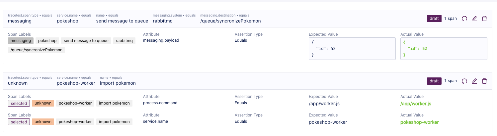

**Validate the PokeAPI HTTP Data Information**

After validating that the message has arrived at the worker, we can start adding assertions to the different steps.

The first one is requesting the pokemon information from the poke API, here we can add multiple checks in regards to url, routes, response, status, etc.

After having selected the worker HTTP span and clicking the **add assertion** button, we can start modifying the different checks.

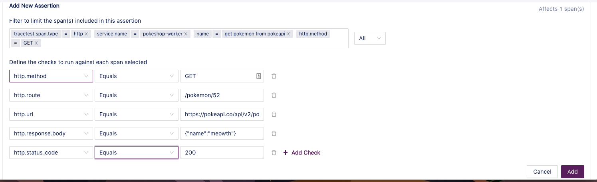

Clicking **save** should show the assertion:

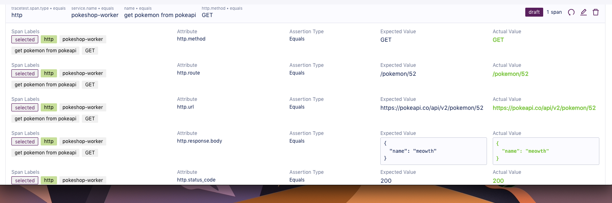

**Validate HTTP Spans Status Code**

With Tracetest you can also add checks for not only one but multiple spans. In this case, we’ll be adding an assertion that will affect every HTTP span to validate that the `http.status_code` is equal `200`.

To start this process, click on any of the HTTP spans and then the **add assertion** button.

Then remove the different selector entries from the first input until the only remaining one is the `tracetest.span.type`.

The last step is to add our check using the `http.status_code` and match it against the `200` value.

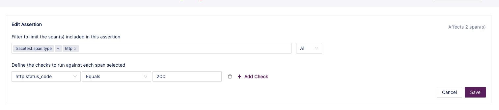

You’ll see the `2 affected spans` message at the top right of the form. By clicking **save**, it will be shown in the main assertions area.

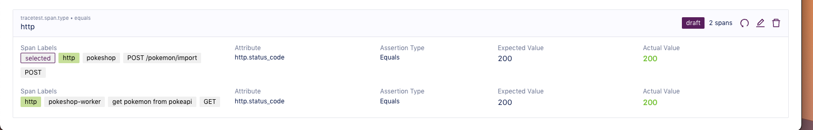

**Validate the Insert Database Statement**

Last but not least, we can add a validation to check if the record was saved to the database by selecting the custom Postgres span and clicking **add an assertion**.

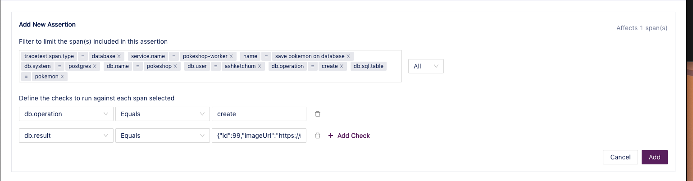

Then we can add checks for both the `db.operation` to match `create` and the result to match the JSON expected object.

Clicking **save** will display the new assertion.

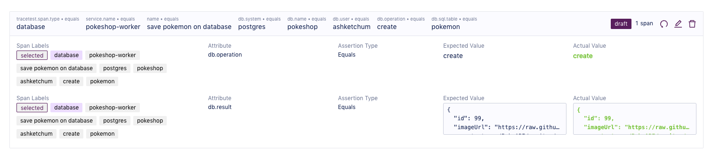
