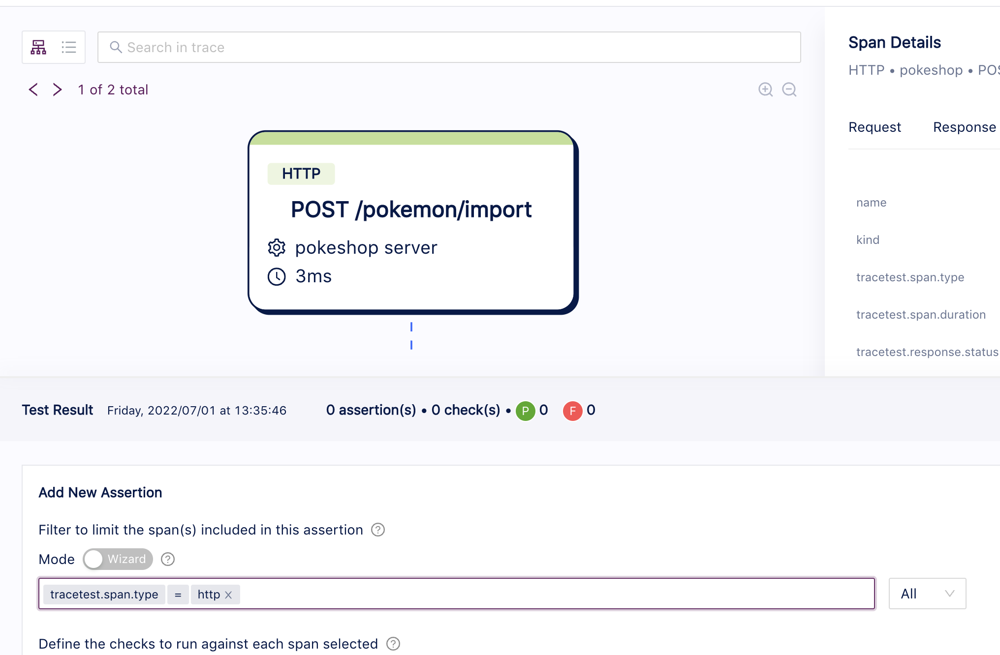
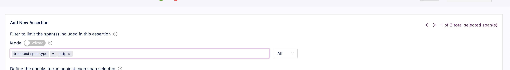
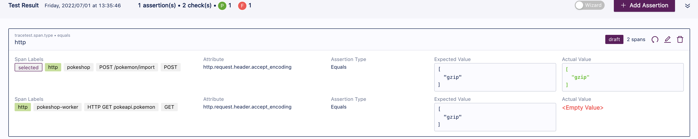
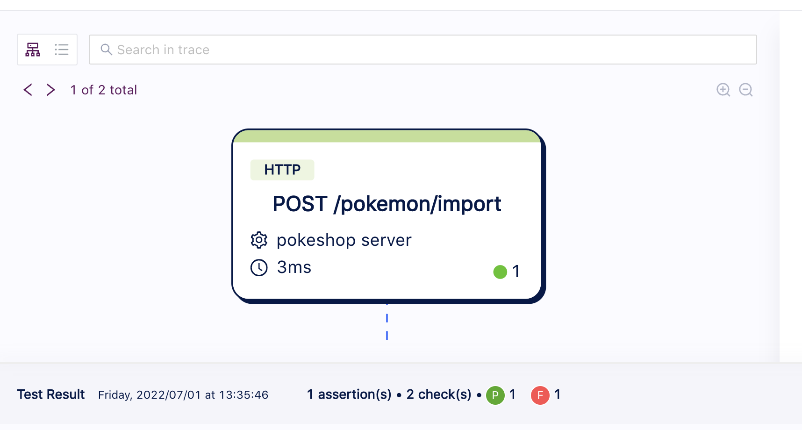

# Affected Spans

As you might know, Tracetest assertions are composed of two main parts:
1. A selector.
2. List of checks.

The selector is used to identify which spans will be affected by the assertion and the system can apply the different checks.
To help the process of visually identifying what spans will be affected, Tracetest highlights them and obscures the rest while either creating/editing an assertion or selecting an existing one from the test results panel.

## Creating an Assertion
When updating the different key value pairs to narrow down the specific span, a new control will be displayed at the top left section of the Diagram view, which has the option to move across the different affected spans.

At the same time, this control component will be displayed at the assertion form level; where the user has the same options to move across the affected spans and have a visual indication of what exactly is happening.

## Selecting an Existing Assertion
By opening the Test Result bottom section, you can find the different assertions and, when clicking on any of them, the affected spans will be automatically highlighted and the controls will be displayed at the top left of the diagram.

Selecting an Assertion

Diagram View
