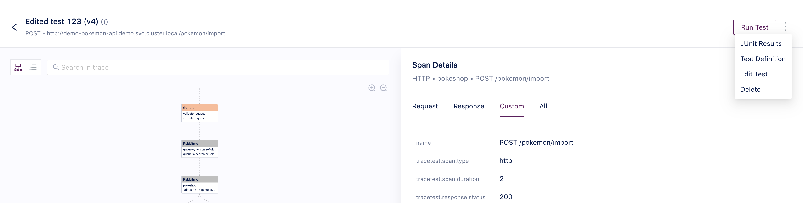
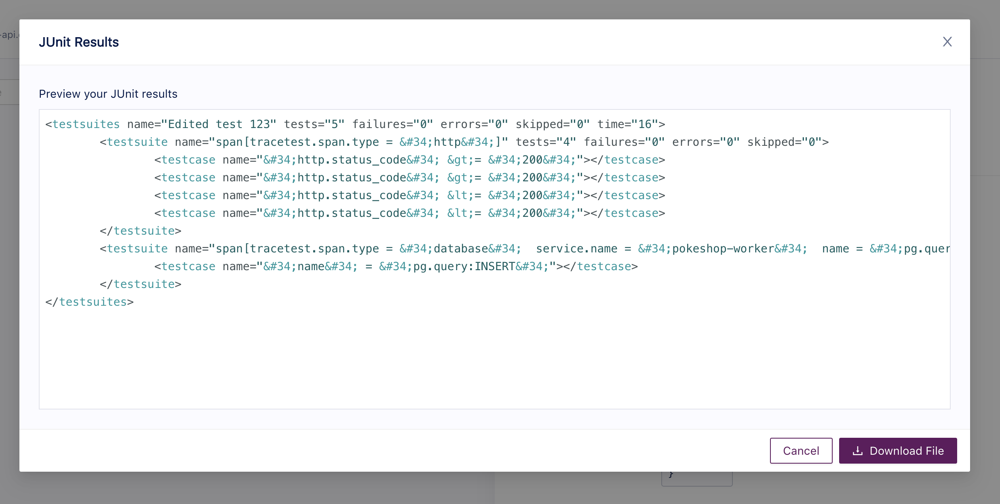
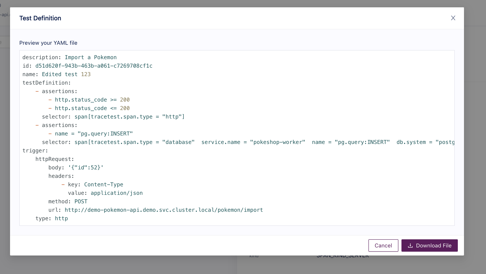

# Edit a Test

Tracetest allows you to export the different set of information displayed for assertions and checks in a way you can use it as input for other tools, create text based tests to use on your CI/CD pipelines using the CLI or more.

The current supported exports are:
1. JUnit results XML.
2. Test Definition YAML.

To access any of the available exports just head to the run/trace page details for any test and at the header level you'll find a three dot menu with will display the options.

## JUnit Results XML
To access the JUnit xml file select the JUnit option from the dropdown and you'll find the file viewer modal with the information where you can directly download the file.
The JUnit report contains the results from each of the assertions added to the test and their statuses. Depending on how many assertions the test has the file will grow.

## Test Definition YAML
The Tracetest CLI allows you to execute text based tests, this means that you can store all of your tests in a repo, keep track of the different versions and use then for your CI/CD process.
To have an easy start you can export the test definition directly from the UI by selecting the option from the dropdown.
Then the file viewer modal should popup where you can copy paste or download the file.

