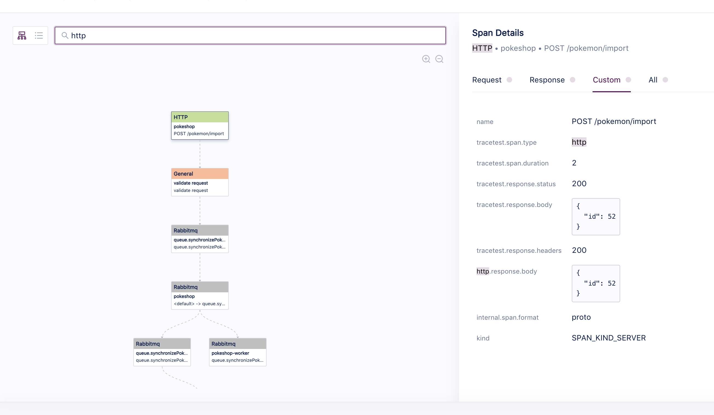
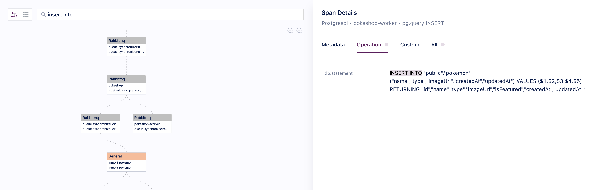

# Text Search

Tracetest enables you to find the information you need more easily by using the text search input at the top of the Diagram view.
You can type text into the search and the app will try to match it with any span attribute key and value while highlighting the options for you.

To use this feature, go to the any run details page and identify the search input.
Then simply add any text you want to look for.

Search for 'http':

Match the 'insert into' statement:
