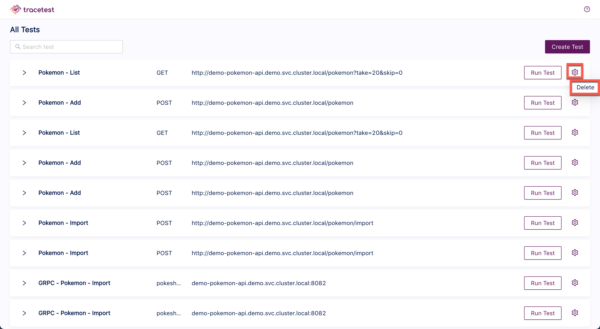
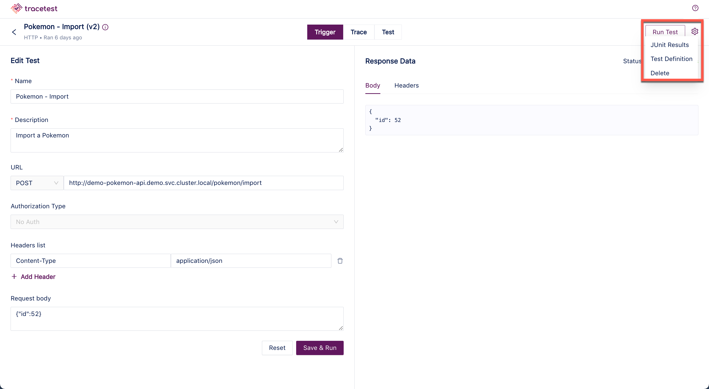
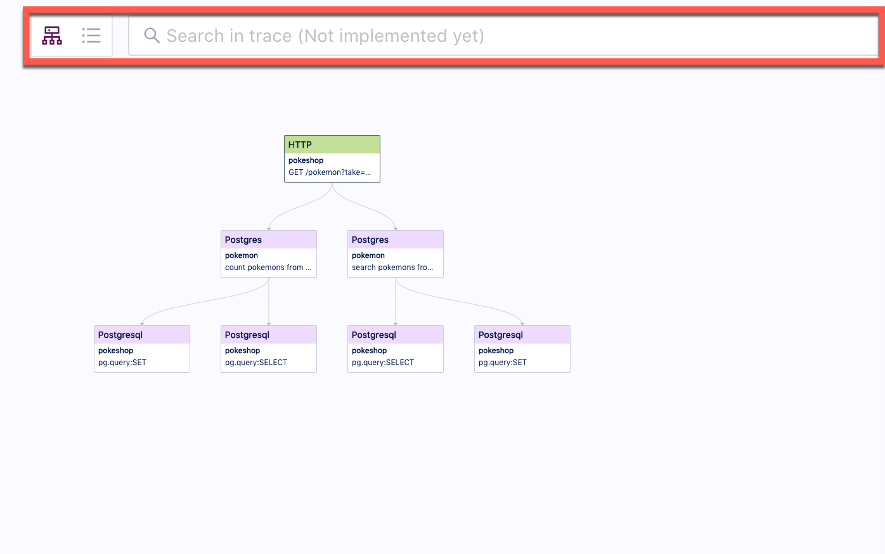
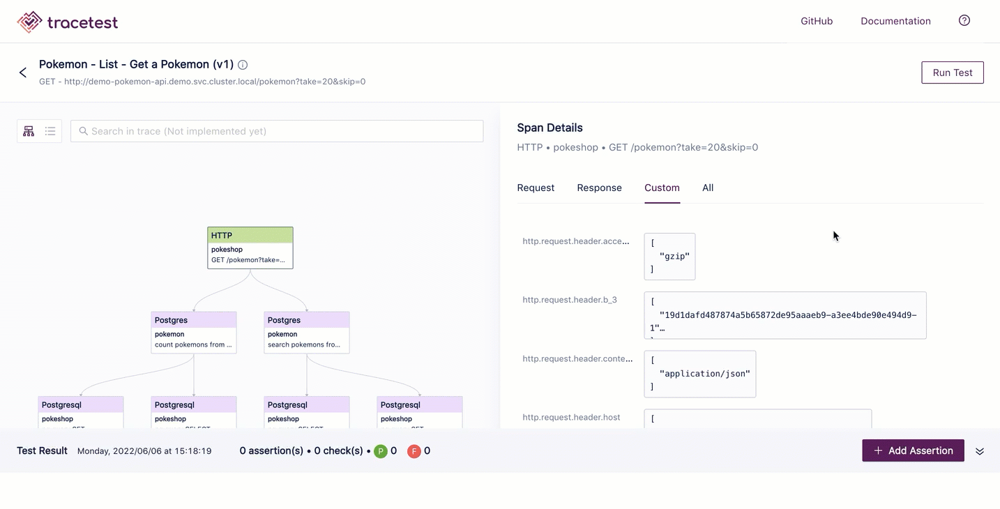

# Test Results

From the **All Tests** screen, you can access all your existing tests, create new tests and see the results of any test that has been run.  

From the ellipsis (...) to the right of each test, there are actions that can be performed. **Edit** and **Delete** actions are available:

Click on the test name and the list of test runs will appear:

Click on a test run and the test details screen will open. On the top right, there is a button to run the test and an ellipsis with the following options:

- JUnit Results - The test results in JUnit format.
- Test Definition - The test defintion YAML file.
- Eidt Test - Edit the details of the test.
- Delete - Delete the test.

On the left is the **Graph View** of the test run:

In the **Graph View**, use the icons at the top right to manipulate the graph. The option are:

- Zoom In
- Zoom Out
- Fit View
- Mini Map

Use the toggle button highlighted below to switch to the **Timeline View**:

Clicking on a step in the test in either the **Graph View** or the **Timeline View** will open the details of that step on the right of the screen.

<!-- The test results include:

- A diagram of the trace steps that can be viewed in diagram or timeline form by toggling the icons at the top left of the image below. This panel also contains a **search** field which can be useful when working with large diagrams and timelines.

- The span details of the trace:
 -->
