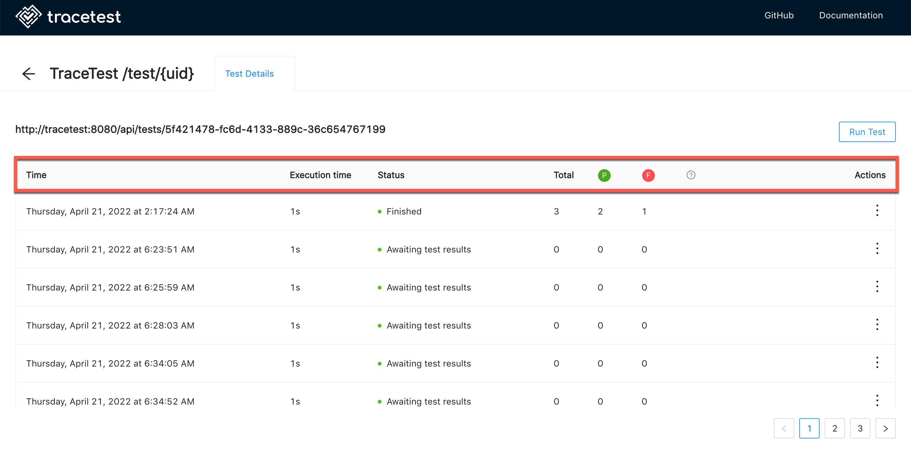
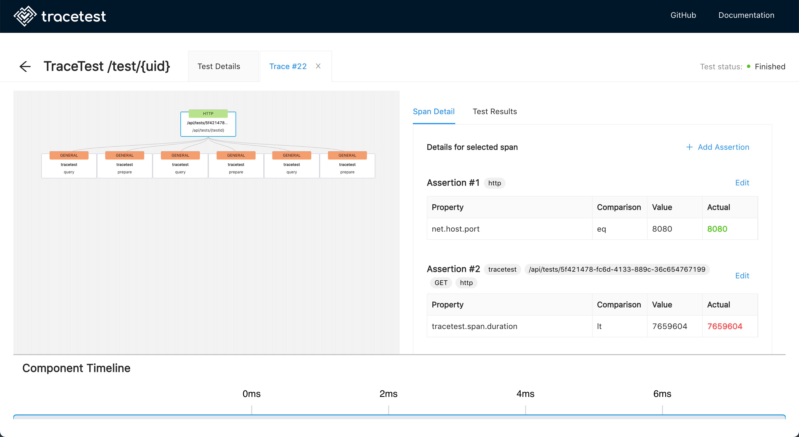

# Working with Traces

All tests will be listed in the dashboard:

Select a test to see its trace details:

Each run of the test is listed here along with the Execution Time, Status, Total Number of Assertions, Number of Assertions Passed, Number of Assertions Failed and Actions available for the test.

Select a run of the test and the Tracetest dashboard will display:

