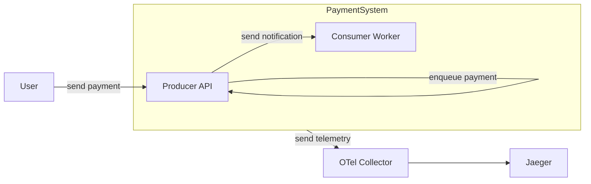

## gRPC stream propagation

This example shows a system with two components working together to process payment data in a Producer / Consumer fashion. Every component is instrumented with OpenTelemetry and sends trace data to a Jaeger instance. The system is composed of:
- a **Producer API** that receives payment data from customers, enqueue it internally and publishes it through a gRPC stream.
- a **Consumer worker** who reads a gRPC stream of payment data and processes it.
- an **OTel Collector** that receives trace data from both components and forwards it to a Jaeger instance.
- a **Jaeger instance** that stores and displays trace data.



### Running the example

To run this example, you need to have the following tools installed:
- [Docker](https://www.docker.com/)
- [Tracetest CLI](https://docs.tracetest.io/getting-started/installation#install-the-tracetest-cli)
- [grpcurl](https://github.com/fullstorydev/grpcurl?tab=readme-ov-file#installation)
  
You can run this example using your environment on [Tracetest](https://app.tracetest.io), or using Tracetest Core. Having a [Tracetest Agent](https://docs.tracetest.io/configuration/agent) configured on Tracetest UI and having an API Key, you can run the following commands:

```sh
TRACETEST_API_KEY="your-api-key" docker compose up
```

This command will start the Producer API, Consumer Worker, OTel Collector, Tracetest Agent, and Jaeger instance.

You can execute a gRPC call to the Producer API with the following command:

```sh
grpcurl -plaintext -proto ./proto/paymentreceiver.proto -d '{ "customerId": "1234", "amount": 50000 }' localhost:8080 proto.PaymentReceiver/ReceivePayment

# Expected output
# {
#   "received": true
# }
```

This will start the entire process of receiving and notifying a payment, which you can see done in the logs of the Producer API and Consumer Worker:
```sh
consumer-worker-1  | 2024/06/12 19:37:03 Received payment notification: payment:{customerId:"1234" amount:50000} highValuePayment:true metadata:{key:"traceparent" value:"00-ac8e8ed08353f23cbf1028ef42e7d10f-a95f55a8f9d9e29c-01"}
```

You can access the Jaeger UI at http://localhost:16686 and see the trace generated by this call.

### Testing the example

You also can run the tests of this example to guarantee that everything is working as expected. First, configure the Tracetest CLI to connect to your environment:
```sh
tracetest configure
# and follow the instructions shown by the CLI
```

Configure it to read traces from Jaeger with the command:

And finally, run the test:
```sh
tracetest run test -f ./trace-based-test.yaml

# Expected output
# ✔ RunGroup: #ISI8sDUSR (https://app.tracetest.io/organizations/your-org-id/environments/your-env-id/run/ISI8sDUSR)
#  Summary: 1 passed, 0 failed, 0 pending
#   ✔ Test gRPC Stream Propagation (https://app.tracetest.io/organizations/your-org-id/environments/your-env-id/test/pprDfSUSg/run/1/test) - trace id: 808e8592f1ec08bda8701c3dcea5810c
#         ✔ It should call ReceivePayment gRPC endpoint
#         ✔ In should enqueue the payment to send it in a stream
#         ✔ It should send the a payment notification through a gRPC stream
#         ✔ It should receive a PaymentNotification through a stream and process it
#         ✔ The trace shape is correct
```

