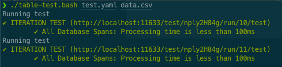
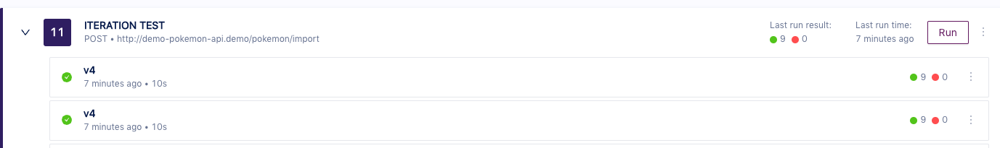
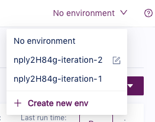

# Table Driven Tests example

Tracetest does not yet support [Table Driven Tests](https://en.wikipedia.org/wiki/Data-driven_testing) as a feature, but it is possible to achieve the same result with some scripting.

This example script allows to run any test with any CSV file.

## How to run the example

You need to have a Tracetest server running and the CLI setup. Then run the script:

```bash
./tabe-test.bash test.yaml data.csv
```



## How it works

Table driven tests works by iterating over a list of values, and running the same test with different parameters each time.
Tracetest supports running tests with parameters via environment variables. We are only missing an automated way to pass a list of values.

The `table-test.bash` script does exactly that. It relies on bash and a few POSIX commands to parse a given CSV file.
For each row of the file, it creates a new environment in tracetest, named after the test ID and current csv line number.
It then runs the test in the definition file provided in the arguments, using the environment it just created.

The UI shows the same test version being run twice:



And the created environments:


