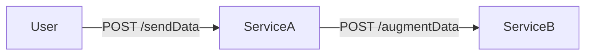

## Testing Context Propagation with Automatic Instrumentation

### Overview

This example demonstrates how to test context propagation with automatic instrumentation. It consists of a simple application that uses a backend service to store data. The application is instrumented with OpenTelemetry and sends traces to an Jaeger backend. 



### Requirements

To run it you need:

- [Docker](https://www.docker.com/get-started/)
- [Tracetest CLI](https://docs.tracetest.io/getting-started/overview)

You will need to have a Tracetest.io account and an environment to run this example. Once that you created it, add an `.env` file with the following content:

```bash
TRACETEST_ENVIRONMENT_ID=...
TRACETEST_API_KEY=...
```

You can get the values for both `TRACETEST_ENVIRONMENT_ID` and `TRACETEST_API_KEY` on the page: https://app.tracetest.io/retrieve-token

### Running the Example

After setting up the environment, you can run the example with the following commands:

```bash
docker compose up
```

And to run the test you can execute the following commands: 

```bash
tracetest configure ## connect to your environment

tracetest apply datastore -f ./tracetest/tracing-backend.yaml
```
