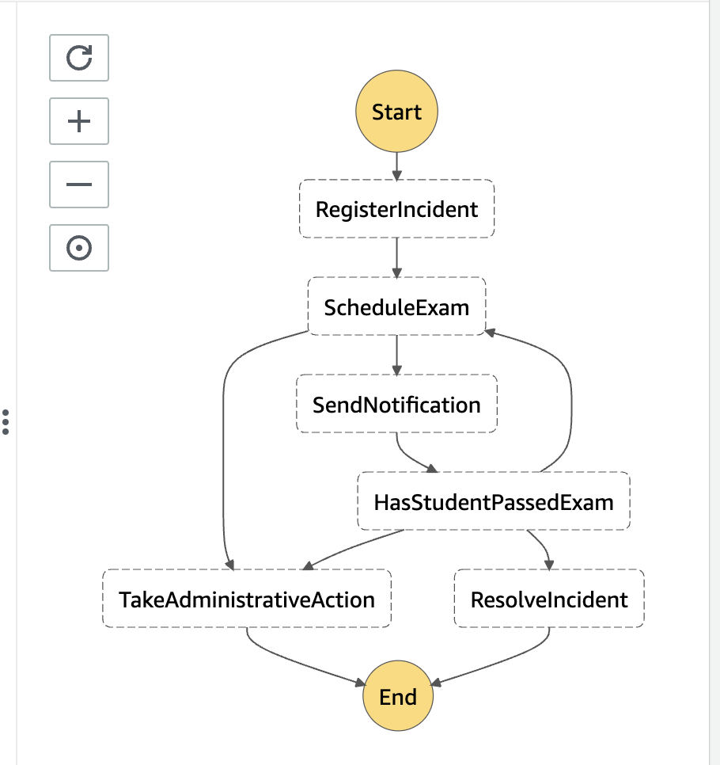

# Quick Start - Tracetest with Terraform, XRay, Step Functions and .NET

This is a simple quick start on how to configure a .NET State Machine (AWS Step Functions) using XRay instrumentation and Tracetest for enhancing your E2E and integration tests with trace-based testing. The infrastructure will use Jaeger as the trace data store and Terraform to provision the required AWS infrastructure (Fargate/Lambda).

## Steps

1. [Install the tracetest CLI](https://github.com/kubeshop/tracetest/blob/main/docs/installing.md#cli-installation)
2. From the `infra` folder run `terraform init` and `terraform apply` and accept the changes
3. From the terraform outputs, grab the `tracetest_url` and run `tracetest configure --server-url <tracetest_url>` on a terminal to configure the CLI to send all commands to that address
4. From the `src` folder run `sam build` and `sam deploy --guided`
5. Follow the instructions from the guided deployment

6. Grab the API gateway endpoint from the outputs, and update the `<your_api_endpoint>` section from `test/incident.yaml` and the `test/exam.yaml` files
7. Inject the Tests and Transactions definitions to the tracetest server  using the following:

```bash
tracetest run test -f tests/incident.yaml \
tracetest run test -f tests/exam.yaml \
tracetest run transaction -f tests/transaction.yaml
```

Feel free to check out the [docs](https://docs.tracetest.io/), and join our [Slack Community](https://dub.sh/tracetest-community) for more info!
