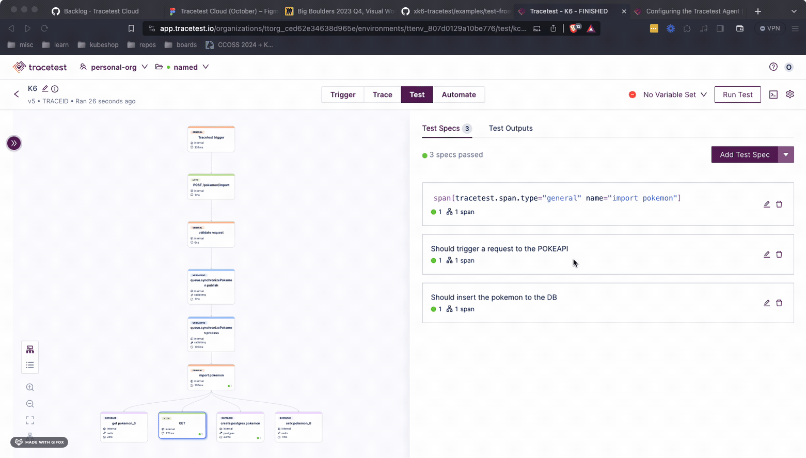

# Tracetest + K6

This example's objective is to show how you can run load tests enhanced with trace-based testing using Tracetest Cloud and k6 against an instrumented service (Pokeshop API).

For more detailed information about the K6 Tracetest Binary take a look a the [docs](https://docs.tracetest.io/tools-and-integrations/integrations/k6).

## Prerequisites

1. Signing up to [app.tracetest.io](https://app.tracetest.io).
2. Creating an [environment](https://docs.tracetest.io/concepts/environments).
3. Having access to the environment's [agent token](https://docs.tracetest.io/configuration/agent).

## Steps

1. [Install the Tracetest CLI](https://docs.tracetest.io/installing/).
2. Copy the `.env.template` file into `.env` and add the `TRACETEST_API_KEY`. This is the Agent API token from your environment.
3. Create a [token from your environment](https://docs.tracetest.io/concepts/environment-tokens).
4. Run `tracetest configure` on a terminal and select the environment in use.
5. Run the project by using docker-compose: `docker-compose up -d` (Linux) or `docker compose up -d` (Mac).
6. Test if it works by running: `tracetest run test -f tests/test.yaml`. This will create and run a test with trace id as the trigger.
7. Build the k6 binary with the extension by using `xk6 build v0.42.0 --with github.com/kubeshop/xk6-tracetest`.
8. Now you are ready to run your load test; you can achieve this by running the following command: `XK6_TRACETEST_API_TOKEN=<your-environment-token> ./k6 run ./import-pokemon.js -o xk6-tracetest`.
9. After the load test finishes you should be able to see an output like the following:

```bash
./k6 run ./import-pokemon.js -o xk6-tracetest
context menu


          /\      |‾‾| /‾‾/   /‾‾/
     /\  /  \     |  |/  /   /  /
    /  \/    \    |     (   /   ‾‾\
   /          \   |  |\  \ |  (‾)  |
  / __________ \  |__| \__\ \_____/ .io

  execution: local
     script: ./import-pokemon.js
     output: xk6-tracetest-output (TestRunID: 38055)

  scenarios: (100.00%) 1 scenario, 1 max VUs, 35s max duration (incl. graceful stop):
           * default: 1 looping VUs for 5s (gracefulStop: 30s)

[TotalRuns=6, SuccessfulRus=1, FailedRuns=5]
[FAILED]
[Request=GET - http://localhost:8081/pokemon/import, TraceID=dc0718bcecceeec731b343235eb9c15a, RunState=FINISHED FailingSpecs=true, TracetestURL= https://app.tracetest.io/organizations/ttorg_ced62e34638d965e/environments/ttenv_807d0129a10be776/test/kc_MgKoVR/run/11]
[Request=POST - http://localhost:8081/pokemon/import, TraceID=dc0718fe83cfeec7315daf10d212d351, RunState=FINISHED FailingSpecs=true, TracetestURL= https://app.tracetest.io/organizations/ttorg_ced62e34638d965e/environments/ttenv_807d0129a10be776/test/kc_MgKoVR/run/4]
[Request=POST - http://localhost:8081/pokemon/import, TraceID=dc0718a8f4ceeec731e47f13762e61b8, RunState=FINISHED FailingSpecs=true, TracetestURL= https://app.tracetest.io/organizations/ttorg_ced62e34638d965e/environments/ttenv_807d0129a10be776/test/kc_MgKoVR/run/8]
[Request=POST - http://localhost:8081/pokemon/import, TraceID=dc0718bcecceeec731b343235eb9c15a, RunState=FINISHED FailingSpecs=true, TracetestURL= https://app.tracetest.io/organizations/ttorg_ced62e34638d965e/environments/ttenv_807d0129a10be776/test/kc_MgKoVR/run/9]
[Request=POST - http://localhost:8081/pokemon/import, TraceID=dc071893fcceeec731148270c6671a1e, RunState=FINISHED FailingSpecs=true, TracetestURL= https://app.tracetest.io/organizations/ttorg_ced62e34638d965e/environments/ttenv_807d0129a10be776/test/kc_MgKoVR/run/6]
[SUCCESSFUL]
[Request=POST - http://localhost:8081/pokemon/import, TraceID=dc0718cee4ceeec731f3f414bf3a2a16, RunState=FINISHED FailingSpecs=false, TracetestURL= https://app.tracetest.io/organizations/ttorg_ced62e34638d965e/environments/ttenv_807d0129a10be776/test/kc_MgKoVR/run/3]

running (05.0s), 0/1 VUs, 5 complete and 0 interrupted iterations
default ✓ [======================================] 1 VUs  5s
```

## What's Next?

After running the initial set of tests, you can click the run link for any of them, update the assertions and run the scripts once more. This flow enables complete a trace-based TDD flow.


