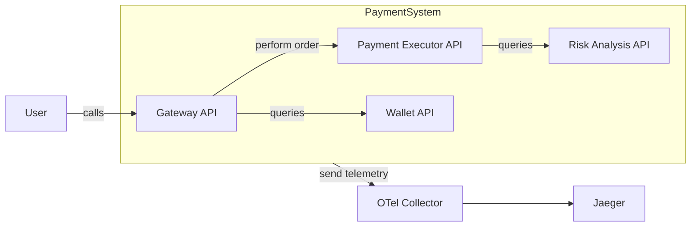

# Running Tracetest with secrets on Github Actions

This example shows how you can run Tracetest injecting secrets in a Github Action pipeline.

We are testing an example Payment ecosystem with [Tracetest](https://tracetest.io/), through the main CI script can be seen on [run-trace-based-tests.yml](./githubworkflows/run-trace-based-tests.yml) that could be put under `.github/workflows` folder in your repository
This script executes a trace-based test that will call the user-facing API with basic auth (that is stored in a Github Secret) and validates if every internal service is properly working.

## Application to be tested

We are testing four APIs that work together to emulate a Payment system. There are 4 APIs:
- [Gateway API](./services/gateway-api): user-facing API that receives payment orders, protected with Basic Auth
- [Payment Executor API](./services/payment-executor-api): executes a payment order after analyzing the customer profile
- [Risk Analysis API](./services/risk-analysis-api): analyze user profile to understand its score
- [Wallet API](./services/wallet-api): retains data about the Wallet balance of each user

These APIs are instrumented with [OpenTelemetry SDKs](https://opentelemetry.io/docs/languages/) and send data to [Jaeger](https://www.jaegertracing.io/) via the [OTel Collector](https://opentelemetry.io/docs/collector/).

