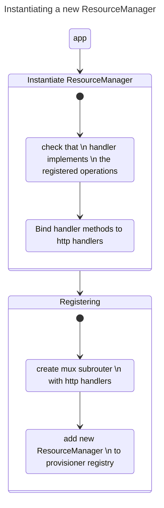

# Resource Manager

`ResourceManager` provides reusable shared operations among resources. This includes the CRUD operations via HTTP, support for different output encodings (yaml or JSON), and Provisioning.

## What is a Resource?

A `Resource` is, conceptually, any entity that can be created, read, updated and/or deleted.
Some examples in Tracetest includes `Test`, `Transaction`, `PollingProfile`, etc.

## How this works

A `ResourceManager` can be instantiated with a few arguments: 
- Resource name, singular and plural,
- List of enabled operations,
- Handler

The handler is a class that handles the persistence of entities. It must support **at least** the required methods for the enabled operations.

For example, a resource that wants to enable the `create` operation needs to provide a Handler that has a `Create` method.

The provisioning process is handled by an external `Provisioner` class, but the `ResourceManager` instance handles the actual provisioning, meaning the actual persistence of the provisioning data.

Here is a flow of a `ResourceManager` setup process:

